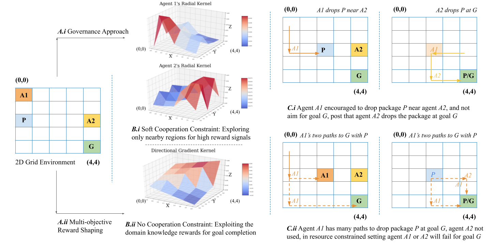
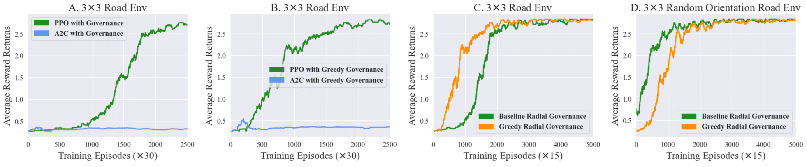
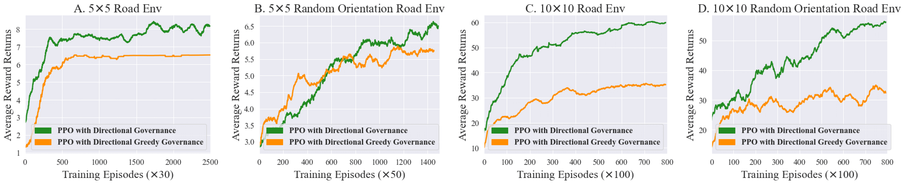
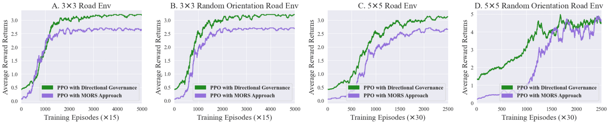
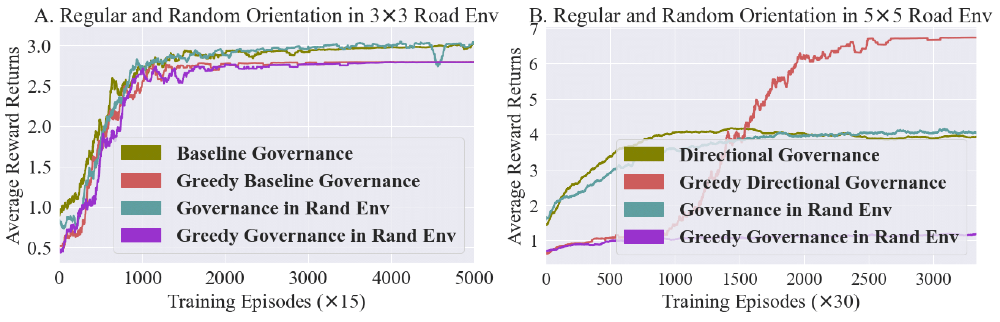

### Reward Shaping Governance Approach for Sparse Package Delivery Task

In this repository we present experimentation for the IE 694's AI in manufacturing portfolio.
The codebase presents experiments for a reward shaping pipeline where a centralized governing controller coordinates agents for delivering packages within the warehouse, refer Figure 1.
In our defined RL problem environment the two agents must cooperate amongst each other to deliver the package from the starting location to the defined goal location.
Only after completing this delivery task which is composed of subtasks like picking, dropping, and sharing the package the reward is assigned.
The partial completion of the task with completion of any of the subtask does not give any reward signal as output.

Also, Figure 1 highlights assigning agent specific reward prior signals for the centralized governance system, which encourages local exploration by assigning higher rewards for traversing nearby regions.
This approach is compared with baseline Multi-objective Reward Shaping (MORS) which assigns specific rewards for every subtask completion.
We explore the impact of adding agent specific reward signals on centralized training centralized execution (CTCE) based learning with Proximal Policy Optimization (PPO).

<p align="center">
  
</p>
<p align="center">
<b>Figure 1:</b> The functional diagram compares two reward shaping based approaches, namely: i) Governance Kernel Reward Shaping, ii) Multi-objective Reward Shaping.
</p>

**`TL;DR`**: `We add inverse squared radial reward (1/x ** 2) prior signals for each agent, and observe the impact on learning on the highly sparse package delivery problem.
With our experimentation we observe that this approach assists in faster and robust learning.
The current experimentation only explores this reward shaping based governance experimentation on a smaller scale.
And, the robustness of our approach is currently only tested for spatial environments only.`

### Table of Contents

* [Environment Description](#environment-description)
* [Approach Ideation](#approach-ideation)
* [Experimentation Notebooks Description](#experimentation-notebooks-description)
* [Experimentation Results and Discussion](#experimentation-results-and-discussion)
* [Citing the Experiment Findings and Accompanying Theoretical Document](#citing-the-experiment-findings-and-accompanying-theoretical-document)

#### Environment Description

The environment presented is representative of 2D grid road or network where agents can move in four directions across this plane, namely: `i) Move Up, ii) Move Down, iii) Move Left, iv) Move Right` which comprises the action space.
In this environment, ideally the first agent should pick the package and deliver it closer to the second agent.
Since, none of the agents have enough resources to deliver the package individually to achieve the goal and obtain the rewards.
Therefore, the second agent should pick up the package from the intermediate location, and deliver it to the goal location.
In the environment both the agents observe complete observation space, and it is specifically designed for centralized controller based training following the CTCE paradigm.
The agent dynamics are modeled in two ways, first where the first agent moves till its fuel is finished and then second agent starts moving after the wait.
Second, like a sequential dynamic game setting where each agent takes turns and moves across the environment simulating a more realistic scenario.
There are no rewards associated with any movement in the environment, only the package delivery task completion gives the final reward.
Additionally, for testing the generalization power of the trained model in experiments the environment also enables random rotations.
With which the environment configuration will be randomly rotated during learning and testing stages for testing the approach robustness.

#### Approach Ideation

In our proposed approach, we implement an environment wrapper which assigns reward distributions corresponding to each agent as highlighted in Figure 1.
These reward distributions _(inverse squared radial kernels)_ are then summed for the two agents to generate final reward distributions on which the learning algorithm is trained.
We believe that the added reward signal that is having relatively high magnitude near the initial agent location will encourage location exploration more.
With increased location area exploration the first agent will be able to find the best intermediate drop-off for the second agent.
We call these reward density kernels as _‘Governance Kernels’_ for the defined controller environment wrapper, which we dub as our _’Governance Layer’_.
We believe that this _Governance Layer_ essentially adds soft constraints on the agents to operate more efficiently in their zones or allocated sectors.

Second, we also implemented a _’Greedy’_ governance variant which reduces the reward to 50 % for the already visited states during the learning stage, and tests the impact of dynamically decreasing reward distribution.
We believe that this would encourage the agents to also explore relatively farther distances, and eventually increase their operating zone or sector range.
For baseline comparison we develop a MORS environment wrapper as well which adds in extra rewards for partial subtask completion as well.
Also, gives additional reward for pursuing the right direction towards the goal for faster convergence.
For exactly comparing MORS with our Governance approaches, we also introduce a directional gradient reward signal which adds extra reward for agents exploring in the goal location direction.

#### Experimentation Notebooks Description

This section elaborates more about the Colab notebook files that were used to generate the experiment results for the proposed reward shaping approach.
All the notebooks for each experiment are self-sufficient for replication, and the experimentation plot data is also stored in the `pipeline-artifacts/experiment-results` directory with self-explanatory naming convention.
Also, for all the experimentation notebooks we need to manually fix the inherited environment type for the governance wrapper in order to execute each learning algorithm against different environment.
The [`Performance Experiment Notebook`](experiment-notebooks/grid-road-env-algorithm-performance-experiment.ipynb) contains detailed functional documentation of the build environments, governance wrappers, and model training process.
The other experimentation notebooks only contain the section hyperlinks for easy notebook navigation to get higher level experiment process understanding.

* [`Performance Experiment Notebook`](experiment-notebooks/grid-road-env-algorithm-performance-experiment.ipynb): The performance experiment notebook tests A2C and PPO RL algorithm performances for _stablebaselines_ implementation against 3x3 fixed and random orientations with the proposed governance variants. 
* [`Scalability Experiment Notebook`](experiment-notebooks/GridRoadEnv-scalability-experiment.ipynb): The scalability experiment notebook tests PPO RL algorithm performance for _stablebaselines_ implementation against 5x5 and 10x10 fixed and random environment orientations with the proposed governance variants.
* [`MORS Approach Comparison Notebook`](experiment-notebooks/grid-road-env-approach-comparison-experiment.ipynb): The MORS approach comparison experiment notebook tests the performance of the proposed governance approach against MORS method in 3x3 and 5x5 fixed and random environment orientations.
* [`Dynamic Interaction Experiment Notebook`](experiment-notebooks/grid-road-env-delay-response-experiment.ipynb): The dynamic interaction comparison experiment notebook tests the performance of the proposed governance approach in 3x3 and 5x5 fixed and random environment orientations when both agents are taking alternating chances.
* [`Gym Monitor Experiment Data Plotter Notebook`](experiment-notebooks/gym-monitor-experiment-data-plotter.ipynb): The data plotter notebook loads the csv files present in `pipeline-artifacts/experiment-results` directory and plots all the subplots highlighted below.

#### Experimentation Results and Discussion

In our experimentation tasks we test different aspects of the proposed reward shaping approach, like scalability, performance, robustness etc.
We analyze the convergence plots for the different learning tasks to measure the learning performance improvements.
The monitor logs intermediate timesteps during learning stages, therefore for all plots we have added multiplier _(X)_ factor to give better training timestep estimates.
The first three experiments are modeled with first static environment dynamics, where the first agent completes its move before the second one can start moving.
The last experiment is based on the dynamic sequential game setting where agents take turns for their movements.

`Experiment 1: Algorithm Performance Comparison`

`Aim:` To evaluate performance performance of different RL algorithms on small 3x3 grid configuration.
And, also check the impact of using a greedy governance variant in comparison to the original static reward shaped governance layer.

`Findings:` We find that even relatively well known actor-critic algorithms like A2C did not converge, and this task requires further policy regularization with PPO algorithm for convergence.
Second, for random orientation the convergence is slower for greedy governance layers.
As we believe the lack of zoning structure with decreasing rewards and changing configurations makes cooperation relatively harder to learn.

<p align="center">
  
</p>
<p align="center">
<b>Figure 2:</b> The left two subplots compare A2C and PPO algorithm performance with proposed governance layer and its greedy variant for fixed orientation 3x3 environment grid size. Whereas, right two subplots compare the same governance layers on 3x3 fixed and random orientation environments.
</p>

`Experiment 2: Approach Scalability Analysis`

`Aim:` We intend to quantify the impact of increasing scale on the approach performance.
Specifically, we measure the learning algorithm performance on 5x5 and 10x10 grid sizes.

`Findings:` For 5x5 grid sizes we observe similar performance insights as 3x3 grid sizes but the convergence is slower than earlier.
For 10x10 grid size, we observe a large difference in reward accumulated by the static governance and greedy governance models.
This can be attributed to the fact that on a larger dimension the static governance layer based agents become prone to accumulating redundant positive rewards.
Essentially, the agents keep on roaming to accumulate extra reward before cooperating with other agents which is the unintended consequence of this proposed approach.

<p align="center">
  
</p>
<p align="center">
<b>Figure 3:</b> The left two subplots compare PPO algorithm performance with the proposed governance layer and its greedy variant for fixed and random orientation of 5x5 environment grid size. Whereas, right two subplots compare the same governance layers on 10x10 fixed and random orientation environments.
</p>

`Note:` For large grids we also introduced the directional gradient into our reward scheme to guide agents towards the goal faster.

`Experiment 3: Comparison with MORS Baseline`

`Aim:` We intend to measure the performance improvements specifically achieved by our proposed approach in comparison to the MORS baseline.

`Findings:` From convergence plots we observe that the proposed static governance approach with added directional gradient signal outperforms its equivalent MORS baseline solution.
And, the effect is even more pronounced on higher grid dimensions and rotating environment orientations.

<p align="center">
  
</p>
<p align="center">
<b>Figure 4:</b> The left two subplots compare PPO algorithm performance with the proposed static governance layer and MORS baseline for fixed and random orientation of 3x3 environment grid size. Whereas, right two subplots compare the same things on 5x5 fixed and random orientation environments.
</p>

`Note:` For comparison with the MORS approach we also introduced the directional gradient into our reward scheme for making the comparison more equivalent.

`Experiment 4: Dynamic Agent Interactions Analysis`

`Aim:` We intend to measure the performance robustness and adaptability when agents are acting in real-time scenarios with alternating action choices.

`Findings:` We observe that even in more dynamic scenarios the proposed governance approach converges, and more slowly for 5x5 grid in comparison to 3x3 grid.
Further, we observe that the greedy governance variant behaves in an unpredictable manner for 5x5 grid configuration.
For fixed 5x5 orientation it falls prey to continuous positive reward cycle issue, and for random 5x5 rotations it is unable to learn anything owing to its flailing reward density during learning.

<p align="center">
  
</p>
<p align="center">
<b>Figure 5:</b> The two subplots compare the listed RL algorithm approach performances for 3x3 and 5x5 grid configuration in fixed and random environment orientations.
</p>

`Experiment Result Conclusion:` We conclude that our study does improve the convergence performance for highly sparse environments to some extent.
But, currently the approach does need more fine-tuning for being more scalable and universal.

#### Citing the Experiment Findings and Accompanying Theoretical Document

If you find the experimentation work interesting and useful for your work, please consider citing it with:

```
@misc{manufactoring-marls-case-study,
  author = {Rana, Ashish},
  title = {Exploring Scope of Using Multi-Agent Reinforcement Learning Systems for Efficient Warehouse Management with Robots},
  year = {2023},
  publisher = {GitHub},
  journal = {GitHub repository},
  howpublished = {\url{https://github.com/ashishrana160796/analyzing-cooperative-marls}},
}
```
